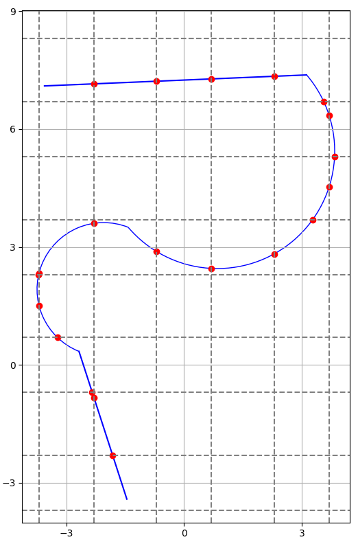

# PathPartition

Python application for dividing 2D paths (created from line segments and circle arcs) into sectors by space tesselation.

# Requirements

`pip install -r requirements.txt`

# Usage

`python src/main.py -f <path_file> -t <tesselation_square_size(optional)>`

for example:

`python src/main.py -f example_paths/example1.json`

Running unit tests:

`cd tests`

`pytest`

# Problem statement

The program input data is a .json file containing a description of two-dimensional path consisting of any number of segments connected to each other. In the current version of the program, 2 types of segments are possible - line segment and circle arc. Path representation format is shown below:

```
{
    "pathID": 0,
    "numberOfSegments": 4,
    "segments": [
        { "isLineSegment": true, "pA": [-1.46, -3.42], "pB": [-2.68, 0.34] },
        {
            "isLineSegment": false,
            "center": [-2.05, 1.92],
            "radius": 1.7,
            "theta1": 68.26,
            "theta2": 248.26,
            "startsFromA": false
        },
        {
            "isLineSegment": false,
            "center": [0.85, 5.44],
            "radius": 2.99,
            "theta1": 220.52,
            "theta2": 40.52,
            "startsFromA": true
        },
        { "isLineSegment": true, "pA": [3.12, 7.38], "pB": [-3.56, 7.1] }
    ]
}
```

The plane consisting the path is divided into square areas by special lines parallel to the X and Y axes of the coordinate system. At the beginning, auxiliary lines are drawn, spaced apart by the distance given by the `tesselation` parameter. Then, for each auxiliary line, two proper lines are drawn on both sides of it, at distance `r`, equal to the radius of the disk representing the robot. The program calculates the points of intersection of the path with these lines, which allows you to divide the path into sectors. These sectors can be used by further algorithms to manage the movement of the robot traveling along such a path.


_Example of path divided into sectors._
